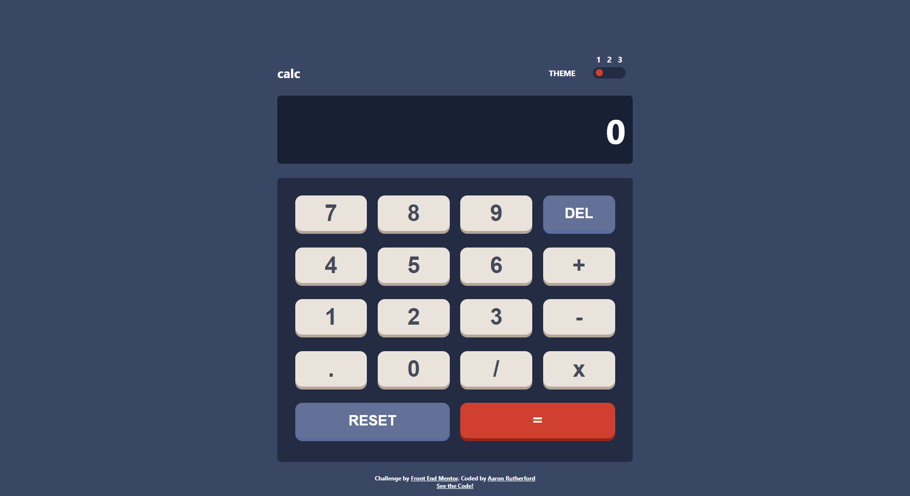

# Frontend Mentor - Calculator app solution

This is a solution to the [Calculator app challenge on Frontend Mentor](https://www.frontendmentor.io/challenges/calculator-app-9lteq5N29). Frontend Mentor challenges help you improve your coding skills by building realistic projects. 

## Table of contents

- [Overview](#overview)
  - [The challenge](#the-challenge)
  - [Screenshot](#screenshot)
  - [Links](#links)
- [My process](#my-process)
  - [Built with](#built-with)
  - [What I learned](#what-i-learned)
  - [Continued development](#continued-development)
  - [Useful resources](#useful-resources)
- [Author](#author)

## Overview

### The challenge

Users should be able to:

- See the size of the elements adjust based on their device's screen size
- Perform mathmatical operations like addition, subtraction, multiplication, and division
- Adjust the color theme based on their preference

### Screenshot

### Links

- Solution URL: [https://www.frontendmentor.io/solutions/calculator-app-using-scss-and-react-GXqP_s2eE7](https://www.frontendmentor.io/solutions/calculator-app-using-scss-and-react-GXqP_s2eE7)
- Live Site URL: [https://hazipan.github.io/calc-app/](https://hazipan.github.io/calc-app/)

## My process

### Built with

- SASS/SCSS
- Flexbox
- [React](https://reactjs.org/) - JS library

### What I learned

I learned how to handle a complex set of interactible buttons and create a 3-way switch

### Continued development

I need to learn how to better organize and implement my code. I feel like my code could have been better organized and more efficient.

### Useful resources

- [Sitepoint](https://www.sitepoint.com/react-tutorial-build-calculator-app/) - This helped me understand all the functionality that goes into a calculator. Reading through their code and really making sense of it was a huge help.

## Author

- Github - [Hazipan](https://github.com/Hazipan/)
- Frontend Mentor - [@Hazipan](https://www.frontendmentor.io/profile/Haizpan)